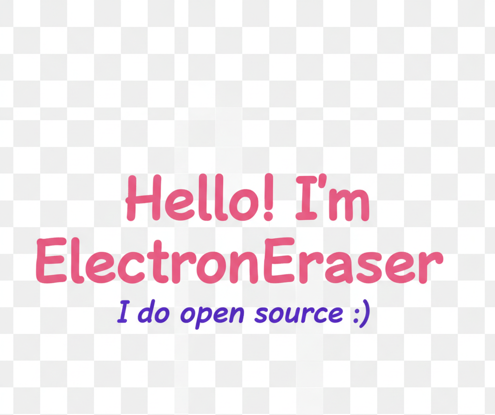

    

&nbsp;

	<!-- <a href='https://www.microsoft.com/windows/windows-11'> -->
		
	</a>
	<!-- <a href='https://www.oneplus.com/'> -->
		
	<!-- </a> -->

&nbsp;

    <!-- <a style="display:inline-block" href='https://html.spec.whatwg.org/'> -->
        
    <!-- </a> -->
    <!-- <a style="display:inline-block" href='https://www.w3.org/Style/CSS/'> -->
        
    <!-- </a> -->
    <!-- <a style="display:inline-block" href='https://www.ecma-international.org/'> -->
        
    <!-- </a> -->
    <!-- <a style="display:inline-block" href='https://git-scm.com/'> -->
        
    <!-- </a> -->
    <!-- <a style="display:inline-block" href='https://react.dev/'> -->
        
    <!-- </a> -->
    <!-- <a style="display:inline-block" href='https://vuejs.org/'> -->
        
    <!-- </a> -->
    <!-- <a style="display:inline-block" href='https://nodejs.org/'> -->
        
    <!-- </a> -->
    <!-- <a style="display:inline-block" href='https://www.python.org/'> -->
        
    <!-- </a> -->

<!-- 

 -->

 

&nbsp;

  

<!--彩虹分割线-->

  <!-- Snake Code Contribution Map 贪吃蛇代码贡献图 -->
  <picture>
    <source media="(prefers-color-scheme: dark)" srcset="https://cdn.jsdelivr.net/gh/Jayce-liang/Jayce-liang/snake/github-contribution-grid-snake-dark.svg" />
    <source media="(prefers-color-scheme: light)" srcset="https://cdn.jsdelivr.net/gh/Jayce-liang/Jayce-liang/snake/github-contribution-grid-snake.svg" />
    
  </picture>

<!--  -->

&nbsp;

<!-- #### My Coding Project And Language -->

    
    

&nbsp;

<h2 align="center">⚡ Stats ⚡</h2>
  

<!--END_SECTION:waka-->

&nbsp;

<!-- #### My Github Activity Graph -->

<!-- programming tool icon 编程工具图标 -->

	 

<!-- svg -->

	
	
	
	
	 
	
	
	
	
	
	
	

<!-- gif -->

